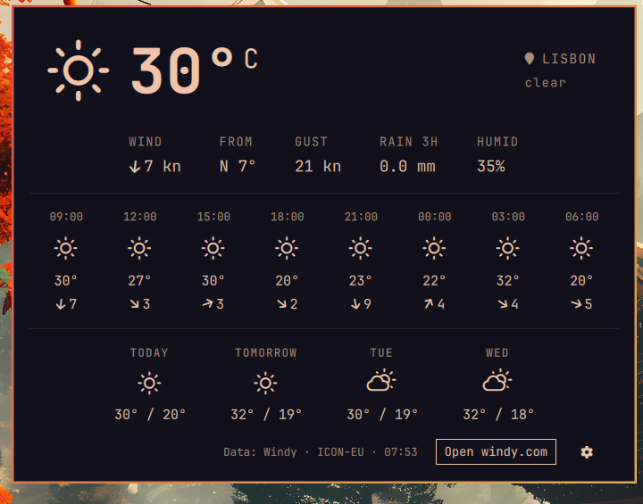

# Windy for Omarchy

A wind, rain, and temperature bar widget for [Omarchy](https://omarchy.org) Quattro, backed by the [Windy Point Forecast API](https://api.windy.com/point-forecast).




- **Bar pill**: condition icon + temperature by default; optionally the rotating wind arrow + speed, or both.
- **Panel**: current conditions, an 8-point hourly outlook (condition, temperature, wind, rain), and a 4-day forecast.
- **Location**: shares `weather.json` with Omarchy's stock weather widget. Click the location to search (Open-Meteo geocoding), or let it auto-detect by IP.
- **Settings**: wind unit, temperature unit, and bar display, from the gear in the panel or the CLI.
- **Credentials**: the API key is stored in the login keyring (Secret Service), never in a config file.

## Requirements

- Omarchy with the Omarchy shell (Quattro).
- A free Windy **Point Forecast** API key: <https://account.windy.com/keys>.
- `curl` at `/usr/bin/curl` and `secret-tool` at `/usr/bin/secret-tool` (both preinstalled on Omarchy).
- A running Secret Service provider; Omarchy's default `gnome-keyring` passwordless keyring qualifies.

The widget uses these network services at runtime:

| Service | Purpose |
| --- | --- |
| `api.windy.com` | Forecast data (requires your API key) |
| `geocoding-api.open-meteo.com` | Location search suggestions |
| `ipwho.is` | First-run location auto-detection when no location is configured |
| `www.windy.com` | Opened in your browser by the panel's "Open windy.com" button |

## Request handling

Every request runs `/usr/bin/curl` by absolute path with a closed environment, so
nothing from the shell environment (including `WINDY_API_KEY`) reaches it and no
`PATH` entry can substitute another binary.

The Windy API expects the key inside the JSON request body. That body is piped to
curl's stdin (`--data-binary @-`) instead of being passed as an argument, so the
key never appears in a process command line, where `/proc/<pid>/cmdline` and
failed-start diagnostics would expose it.

Responses are bounded by curl itself (256 KiB for forecasts, 64 KiB for the
location and geocoding lookups) and by a request timeout, so a hostile or
malformed response cannot grow the shell's in-memory buffer without limit.
Because the environment is closed, proxy variables such as `https_proxy` do not
apply to these requests.

## Credentials

The API key is stored in the login keyring through `secret-tool` under the
attributes `service windy account minholi.windy`. It is never written
to `shell.json`: the widget talks to the keyring with `lookup`, `store`, and
`clear`, pipes the key to `store` over stdin so it never appears in a process
command line, and runs `secret-tool` by absolute path with a minimal
environment limited to the D-Bus session address.

Set the key through the gear icon in the panel (leave the field blank and save
to remove it). From the CLI, use the same keyring entry:

```bash
printf '%s' '<your-key>' | secret-tool store --label='Windy API key' service windy account minholi.windy
secret-tool clear service windy account minholi.windy   # remove
```

Versions before 1.0.3 kept the key in `shell.json`. On first load the widget
migrates that value into the keyring and strips the plaintext entry; the
migration only removes the legacy value after the keyring write succeeded.

As a fallback, the plugin reads the `WINDY_API_KEY` environment variable when
neither the keyring nor a legacy value holds a key.

## Install

```bash
omarchy plugin add https://github.com/minholi/omarchy-windy.git --enable
```

Add your API key through the gear icon in the panel, or from the CLI as shown
under [Credentials](#credentials).

## Remove

```bash
omarchy plugin remove minholi.windy --yes
```

## Settings

Set values with `omarchy bar set minholi.windy <key> <value>` or through the panel's gear icon.

The API key is a credential and lives in the keyring — see [Credentials](#credentials).

| Key | Values | Default | Description |
| --- | --- | --- | --- |
| `unit` | `kn`, `kmh`, `mph`, `ms` | `kn` | Wind speed unit. |
| `temperatureUnit` | `auto`, `c`, `f` | `auto` | Auto resolves by the location's country, then the locale. Rain follows: mm with °C, inches with °F. |
| `display` | `temp`, `wind`, `both` | `temp` | Bar pill: condition + temperature, rotating arrow + speed, or all four. |
| `level` | `surface`, `850h`, `700h`, `500h`, `300h` | `surface` | Wind level; temperature and rain stay at the surface. |
| `model` | `auto`, `gfs`, `icon`, `iconEu`, `iconD2`, `aromeFrance`, `hrrrConus`, `namConus`, `namAlaska`, `namHawaii`, `canHrdps` | `auto` | Auto picks the highest-resolution model covering your coordinates, falling back to GFS. |
| `refreshMinutes` | integer 5–180 | `15` | Forecast refresh interval. |

## Location

The widget reads and writes the same state file as Omarchy's stock weather widget (`~/.local/state/omarchy/settings/weather.json`, owned by `omarchy-weather-location`), so both stay in sync. Click the location label in the panel to search for a city, press Enter to commit, or click ✕ to return to IP auto-detection. A hand-written `{"name": "Malibu"}` entry is resolved to exact coordinates once and upgraded in place.

## Commands

```bash
omarchy-shell minholi.windy status    # JSON snapshot (location, current, hourly, daily, tooltip)
omarchy-shell minholi.windy refresh   # force a fetch
omarchy-shell minholi.windy toggle    # open/close the panel
omarchy-shell minholi.windy edit      # open the location editor
omarchy-shell minholi.windy settings  # open the settings view
```

## Development

```bash
node --test model.test.mjs                  # pure data-shaping tests
omarchy plugin validate .                   # manifest/repository validation
```

QML changes require `omarchy restart shell`; the plugin hot-reload does not rebuild entry-point QML.

## Data and attribution

Weather data comes from the Windy Point Forecast API and is subject to [Windy's terms](https://api.windy.com/point-forecast/pricing). Geocoding is provided by Open-Meteo; IP auto-detection by ipwho.is. This plugin is unofficial and not affiliated with Windyty, S.E.

## License

MIT — see [LICENSE](LICENSE).
